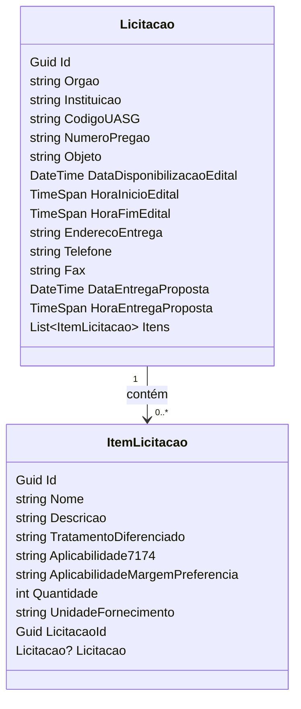

# Scrapper do comprasNET

Este projeto faz parte de um teste técnico para a vaga de Desenvolvedor Pleno. O sistema tem como objetivo capturar e exibir licitações públicas, com backend em C# (.NET), banco de dados MySQL, frontend em Vue.js, e ambiente de testes via Docker.

# Rodando o Projeto Localmente

Este projeto utiliza **Docker** e **Docker Compose** para facilitar a execução local dos serviços.

## Instruções para Rodar

1. Clone este repositório:
   ```bash
   git clone https://github.com/TheyCallMeErick/TesteTecnicoEffecti-
   ```
2. Acesse a pasta do projeto:
   ```bash
   cd TesteTecnicoEffecti-
   ```

3. Execute os containers com:
   ```bash
   docker-compose up
   ```

🧱 Estrutura dos Serviços
- Frontend
  - Local: ./Frontend
  - Disponível em: http://localhost:8080
- Backend
  - Local: ./Backend
  - Disponível em: http://localhost:5041
- Banco de Dados
  - MySQL (versão 9.3.0)
  - Banco: teste_tecnico_effecti
  - Usuário root / Senha: 123
## Funcionalidades Implementadas

### Backend (.NET)
- Foi desenvolvida uma API REST em C# com ASP.NET Core
- Scrapper dos dados do ComprasNet
- A definição das rotas e do backend pode ser encontrada [aqui](./docs/definition.yaml)
- Dados retornados em JSON.
- Testes automatizados com xUnit.
- Validação de entradas, tratamento de erros e arquitetura por camadas (Controller, Service...).


### Modelagem do dos dados
- A estruturação dos dados e normalização ficou assim

### Endpoints disponíveis

### GET /api/Licitacao/apply-migrations

Aplica as migrations no banco de dados, criando todas as tabelas definidas nas entidades.

- Resposta 200: Migrations aplicadas com sucesso.
- Resposta 500: Erro interno ao aplicar as migrations.

### GET /api/Licitacao/sync

Sincroniza as licitações com fontes externas, importando dados e salvando no banco.

- Resposta 200: Sincronização realizada com sucesso.
- Resposta 500: Erro interno ao sincronizar os dados.

### GET /api/Licitacao

Consulta paginada de licitações com filtros opcionais.

#### Parâmetros de query:

- `Uasg`: (string) Código da UASG.
- `Pregao`: (string) Número do pregão.
- `Page`: (int) Número da página (padrão: 1).
- `PageSize`: (int) Tamanho da página (padrão: 10).

#### Respostas:

- 200 OK: Lista paginada de licitações no formato `PaginatedResultDTOOfResponseLicitacaoDTO`.
- 400 Bad Request: Problemas de validação nos parâmetros.

## Estrutura dos dados

### ResponseLicitacaoDTO

Representa uma licitação individual.

| Campo                        | Tipo     | Descrição                                        |
|-----------------------------|----------|--------------------------------------------------|
| id                          | string   | Identificador único                              |
| uasg                        | string   | Código da UASG                                   |
| pregao                      | string   | Número do pregão                                 |
| objeto                      | string   | Descrição do objeto da licitação                 |
| orgao                       | string   | Nome do órgão responsável                        |
| instituicao                 | string   | Nome da instituição                              |
| dataDisponibilizacaoEdital | date-time| Data de publicação do edital                     |
| horaInicioEdital           | string   | Horário de início (com padrão regex)             |
| horaFimEdital              | string   | Horário de fim (com padrão regex)                |
| dataEntregaProposta        | date-time| Data limite para entrega de propostas            |
| horaEntregaProposta        | string   | Horário limite para entrega de propostas         |
| enderecoEntrega            | string   | Endereço para entrega                            |
| telefone                   | string   | Telefone de contato                              |
| fax                        | string   | Número de fax                                    |
| itens                      | array    | Lista de itens da licitação                      |

### ResponseItemLicitacaoDTO

Representa um item da licitação.

| Campo                        | Tipo     | Descrição                                        |
|-----------------------------|----------|--------------------------------------------------|
| id                          | string   | Identificador do item                            |
| nome                        | string   | Nome do item                                     |
| descricao                   | string   | Descrição detalhada do item                      |
| tratamentoDiferenciado      | string   | Informação sobre tratamento diferenciado         |
| aplicabilidade7174          | string   | Informação sobre aplicabilidade da Lei 7174      |
| aplicabilidadeMargemPreferencia | string | Informação sobre margem de preferência           |
| quantidade                  | integer  | Quantidade solicitada                            |
| unidadeFornecimento         | string   | Unidade de fornecimento                          |

## Erros

Em caso de erro, a API retorna um objeto do tipo `ProblemDetails` com os seguintes campos:

- `type`: Tipo do problema
- `title`: Título do erro
- `status`: Código HTTP
- `detail`: Descrição técnica
- `instance`: Caminho do recurso


### Frontend (Vue.js)
Aplicação que consome a API e exibe os dados.
- Filtros:
    - Código da UASG.
    - Número do Pregão.
- Paginação
- Mensagem amigável para "sem resultados".
- Estilização básica com CSS.

## Discussões Técnicas
### Linguagem e Framework
- C# com ASP.NET Core foi escolhido por preferencia pessoal, a experiência foi interessante considerando nunca ter feito scapping com C#, foi utilizada a biblioteca HtmlAgilityPack.

### Otimizações realizadas
- Os dados retornados pela API são paginados, evitando sobrecarga ao lidar com grandes volumes de informações.
- O scrapping foi implementado como um serviço assíncrono, configurado para rodar a cada 8 horas (embora, na prática, não seja utilizado continuamente devido ao teste), sendo assim, devido ao cenário do teste, foi implementado apenas um botão para disparar essa ação, isso leva um certo tempo.
- Foram criados índices nos principais campos de busca das licitações para otimizar as consultas ao banco de dados.
- O HTML instável do site foi tratado com lógica de fallback para prevenir quebras, no entanto podem ocorrer situações inesperadas.
- Devido ao fato do site fazer uma consulta diária, ao verificar as 00:00, não há registros, esse cenário foi previsto e tratado.

### Banco de dados
- As tabelas foram normalizadas, no entanto cabem melhorias, pela duração do teste tudo foi feito da maneira mais rápida possível.

### Boas práticas aplicadas
- Separação clara de responsabilidades.
- DTOs para comunicação entre camadas.
- Validações e exceções customizadas.
- Testes unitários para serviços.
