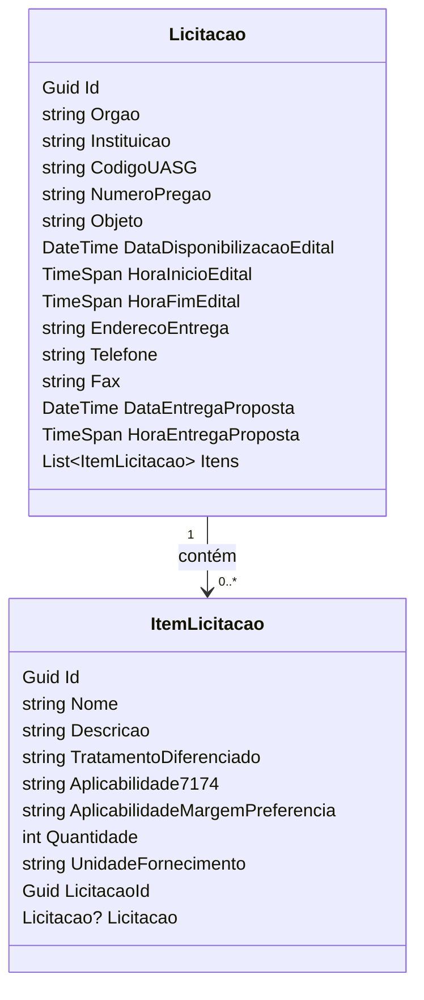

# 📦 Scrapper do comprasNET

Este projeto faz parte de um teste técnico para a vaga de Desenvolvedor Pleno. O sistema tem como objetivo capturar e exibir licitações públicas, com backend em C# (.NET), banco de dados MySQL, frontend em Vue.js, e ambiente de testes via Docker.

## Funcionalidades Implementadas

### Backend (.NET)
- Foi desenvolvida uma API REST em C# com ASP.NET Core
- Scrapper dos dados do ComprasNet
- A definição das rotas e do backend pode ser encontrada [aqui](./docs/definition.yaml)
- Dados retornados em JSON.
- Testes automatizados com xUnit.
- Validação de entradas, tratamento de erros e arquitetura por camadas (Controller, Service...).

### Modelagem do banco de dados (MySQL)
- A estruturação dos dados e normalização ficou assim

### Frontend (Vue.js)
Aplicação que consome a API e exibe os dados.
- Filtros:
    - Código da UASG.
    - Número do Pregão.
- Paginação
- Mensagem amigável para "sem resultados".
- (Bônus) Marcação de licitações como lidas/não lidas.
- Estilização básica com CSS.

## 💬 Discussões Técnicas
### Linguagem e Framework
- C# com ASP.NET Core foi escolhido por preferencia pessoal, a experiência foi interessante considerando nunca ter feito scapping com C#, foi utilizada a biblioteca HtmlAgilityPack.
- As principais otimizações feitas para a aplicação não sofrer com a grande quantidade de dados foram o tratamento de dados que agora devem vir paginados e o scrapping ocorrer em um serviço assincrono que deve ocorrer a cada 8 horas (a implementação foi feita parcialmente, foi implementada, mas acaba por não ser utilizada  tendo em vista que a aplicação não ficará executando por tanto tempo). 

- O HTML instável do site foi tratado com lógica de fallback para prevenir quebras, no entanto podem ocorrer situações inesperadas.
- Devido ao fato do site fazer uma consulta diária, ao verificar as 00:00, não há registros, esse cenário foi previsto e tratado.

### Banco de dados
- As tabelas foram normalizadas, no entanto cabem melhorias, pela duração do teste tudo foi feito da maneira mais rápida possível.

### Boas práticas aplicadas
- Separação clara de responsabilidades.
- DTOs para comunicação entre camadas.
- Validações e exceções customizadas.
- Testes unitários para serviços.